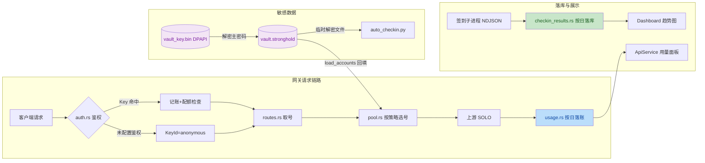

# 优化与新功能实现总结

> 完成时间：2026-09-09。本文档整理 [optimization-plan.md](optimization-plan.md) 中 T1-T11 全部任务的
> **功能需求、业务价值、实现逻辑与关键代码参考**，并附代码审查的修复记录。
> 原始实现交付于低版本产品 **v2.9.0**（trae_work_main 分支）；本分支（fix_trae_optimization，基于高版本 v3.2.7）
> 按文档规格**手工移植**合入（未使用 merge/cherry-pick），适配高版本结构差异（RawAccount.dc_id、trae_apps.rs、
> GeneralSettingsPanel.tsx、单实例防护等），自测（`cargo test` 30/30、`tsc` 通过、`vitest` 13/13、`vite build` 成功）。
> 「移除主 API Key」调整见[第 15 节](#15-追加调整移除主-api-keyv290)。

---

## 1. 总览

### 1.1 任务完成状态

| # | 任务 | 优先级 | 状态 |
|---|------|--------|------|
| T1 | API 网关用量统计（落盘 + 统计面板） | 高 | ✅ 已完成 |
| T2 | 多 API Key + 每日配额管理 | 高 | ✅ 已完成 |
| T3 | 托盘菜单增强（一键签到 / API 启停 / 系统通知） | 高 | ✅ 已完成 |
| T4 | 敏感数据加密（Tauri Stronghold + DPAPI） | 高 | ✅ 已完成 |
| T5 | 签到失败自动重试（最多 2 轮，间隔加长） | 中 | ✅ 已完成 |
| T6 | 日志页增强（按类型清理） | 中 | ✅ 已完成 |
| T7 | 工程欠账：前端 Vitest 测试 + 核心模块注释 | 工程 | ✅ 已完成 |
| T8 | 签到成功率趋势（落盘 + Dashboard 堆叠图） | 新增 | ✅ 已完成 |
| T9 | OpenAI 兼容端点扩展（/v1/completions） | 新增 | ✅ 已完成 |
| T10 | 账号池调度策略 + 分组筛选 | 新增 | ✅ 已完成 |
| T11 | 开机自启 + 启动静默签到 | 新增 | ✅ 已完成 |

> 已排除项（用户明确不做）：通知渠道扩展（Bark/飞书 webhook）、日志导出。

### 1.2 改动文件清单

**新增文件（Rust）**

| 文件 | 职责 |
|------|------|
| [vault.rs](../src-tauri/src/vault.rs) | 敏感数据加密存储（Stronghold + DPAPI） |
| [usage.rs](../src-tauri/src/api_server/usage.rs) | API 用量按日聚合与落盘 |
| [api_keys.rs](../src-tauri/src/api_server/api_keys.rs) | 多 API Key 管理与每日配额 |
| [checkin_results.rs](../src-tauri/src/checkin_results.rs) | 签到结果按日落库 |
| [notify.rs](../src-tauri/src/notify.rs) | 系统通知封装 |

**新增文件（前端/文档）**：[format.ts](../src/lib/format.ts)（纯函数抽取便于测试）、`cn.test.ts` / `delay.test.ts` / `format.test.ts`（13 个用例）、[optimization-plan.md](optimization-plan.md)

**主要修改文件（Rust）**：[main.rs](../src-tauri/src/main.rs)（托盘/自启/静默签到）、[checkin.rs](../src-tauri/src/commands/checkin.rs)（重试/防重入/落库）、[auth.rs](../src-tauri/src/api_server/auth.rs)、[pool.rs](../src-tauri/src/api_server/pool.rs)、[routes.rs](../src-tauri/src/api_server/routes.rs)、[api_server.rs（commands）](../src-tauri/src/commands/api_server.rs)、[misc.rs（commands）](../src-tauri/src/commands/misc.rs)，以及 accounts/oauth/trae_apps 等统一切换 `vault::load_accounts / save_accounts`（高版本无 pay_status.rs / trae_local.rs，Trae 相关能力由 trae_apps.rs 承担）

**主要修改文件（前端）**：[ApiService.tsx](../src/pages/ApiService.tsx)（统计面板 + Key 管理 + 池策略）、[Checkin.tsx](../src/pages/Checkin.tsx)（重试横幅）、[Dashboard.tsx](../src/pages/Dashboard.tsx)（趋势图）、[Logs.tsx](../src/pages/Logs.tsx)（清理按钮）、[GeneralSettingsPanel.tsx](../src/components/GeneralSettingsPanel.tsx)（自启/静默签到开关，高版本设置面板）、[store.ts](../src/store.ts)、[tauri.ts](../src/lib/tauri.ts)

**配置/依赖**：`Cargo.toml`（+ `tauri-plugin-stronghold`、`tauri-plugin-autostart`、`[profile.dev] opt-level=2` 加速加解密调试）、`package.json`（+ `vitest@^2`，`npm run test`）、[auto_checkin.py](../src-python/auto_checkin.py)（+ `--accounts-file` 参数）

### 1.3 新增数据文件与命令契约

| 数据文件 | 结构 | 说明 |
|----------|------|------|
| `conf/vault.stronghold` | Stronghold 快照 | jwt/refresh_token 权威存储（按 uid 键） |
| `conf/vault_key.bin` | DPAPI 加密 blob | vault 主密码（32 字节，仅本机当前用户可解） |
| `data/api_usage.json` | `{ days: { 日期: DayStats } }` | 用量统计，保留 90 天 |
| `data/api_keys.json` | `{ keys: ApiKeyEntry[] }` | 子 Key 列表 + 当日用量记账 |
| `data/checkin_results.json` | `{ days: { 日期: { accounts: { uid: 结果 } } } }` | 签到最终态，保留 90 天 |
| `data/api_pool.json`（扩展） | `{ enabled_uids, strategy, group_ids }` | 旧文件无新字段时默认行为不变 |

新增 Tauri 命令：`api_usage_stats(days)`、`api_keys_list()`、`api_keys_save(keys)`、`checkin_trends(days)`、`logs_clear(log_type)`、`autostart_status()`、`autostart_set(enabled)`；`pool_set` 扩展 `strategy` / `group_ids` 参数。

### 1.4 核心数据流



---

## 2. T1 API 网关用量统计

### 功能需求

按日聚合网关请求数据并落盘（`data/api_usage.json`），维度覆盖：日期 / 模型 / 上游账号 / API Key / 流式与非流式 / 成功失败 / 耗时 / token 用量；提供 `api_usage_stats(days)` 命令，前端 ApiService 页新增「用量统计」区块。验收：请求后当日记录维度计数正确；服务停止后数据仍在；含聚合单元测试。

### 价值

- 网关从「黑盒转发」变为可观测服务：哪个模型、哪个账号、哪个 Key 消耗了多少请求一目了然
- 为 T2 的配额扣减、T10 的账号质量评估提供数据基础
- 落盘数据跨进程存活，重启后统计不丢

### 实现逻辑

1. **鉴权 → 记账的解耦**：鉴权中间件解析命中的 Key ID，通过 axum `request extensions` 插入 `KeyId`；handler 取出用于按 Key 维度记账（服务未启用鉴权时为 `anonymous`）
2. **每次请求完成即原子写盘**：个人使用频率低，写放大可接受，换取「崩溃也最多丢一条」的简单可靠模型（与 `api_keys.json` 同策略）
3. **token 提取兼容双协议**：OpenAI（`prompt_tokens/completion_tokens`）与 Anthropic（`input_tokens/output_tokens`）字段名归一
4. **保留期裁剪**：读写时裁剪超过 90 天的历史，防文件无限增长

### 代码参考

数据结构与聚合核心（[usage.rs](../src-tauri/src/api_server/usage.rs)）：

```rust
/// 请求命中的 API Key 标识（鉴权中间件解析后插入 request extensions）
#[derive(Clone, Debug)]
pub struct KeyId(pub String);

/// 从上游 token_usage 事件中提取 (prompt_tokens, completion_tokens)，
/// 兼容 OpenAI / Anthropic 两种字段命名；缺失时返回 0
pub fn extract_tokens(u: &serde_json::Value) -> (u64, u64) {
    let get = |keys: &[&str]| -> u64 {
        keys.iter()
            .find_map(|k| u.get(*k).and_then(|v| v.as_u64()))
            .unwrap_or(0)
    };
    (
        get(&["prompt_tokens", "input_tokens"]),
        get(&["completion_tokens", "output_tokens"]),
    )
}

/// 单日统计：汇总 + 分维度计数
#[derive(Serialize, Deserialize, Clone, Default, Debug)]
pub struct DayStats {
    pub total: Counter,
    pub stream: Counter,      // 流式请求数（含其中的失败数）
    pub non_stream: Counter,  // 非流式请求数
    pub prompt_tokens: u64,
    pub completion_tokens: u64,
    pub duration_ms_total: u64,             // 累计耗时，用于算平均
    pub models: HashMap<String, Counter>,   // 按模型
    pub accounts: HashMap<String, Counter>, // 按上游账号，"none"=无健康账号
    pub keys: HashMap<String, Counter>,     // 按 API Key，"anonymous"=未启用鉴权
}

impl DayStats {
    pub fn record(&mut self, model: &str, uid: &str, key_id: &str, ok: bool,
                  is_stream: bool, duration_ms: u64, prompt_tokens: u64, completion_tokens: u64) {
        self.total.add(ok);
        if is_stream { self.stream.add(ok); } else { self.non_stream.add(ok); }
        self.prompt_tokens += prompt_tokens;
        self.completion_tokens += completion_tokens;
        self.duration_ms_total += duration_ms;
        self.models.entry(model.to_string()).or_default().add(ok);
        self.accounts.entry(uid.to_string()).or_default().add(ok);
        self.keys.entry(key_id.to_string()).or_default().add(ok);
    }
}

/// 裁剪保留期之外的历史日期
pub fn trim(&mut self, keep_days: i64) {
    let cutoff = chrono::Local::now().date_naive() - chrono::Duration::days(keep_days);
    let cutoff_str = cutoff.format("%Y-%m-%d").to_string();
    self.days.retain(|d, _| d.as_str() >= cutoff_str.as_str());
}
```

查询命令（直读落盘，服务未运行也可查看，[api_server.rs](../src-tauri/src/commands/api_server.rs#L462-L466)）：

```rust
#[tauri::command]
pub fn api_usage_stats(state: State<'_, AppState>, days: Option<u32>)
    -> Vec<crate::api_server::usage::UsageDayView> {
    let days = days.unwrap_or(14).clamp(1, 90);
    crate::api_server::usage::query_recent(&state.data_dir, days)
}
```

前端绑定与区块（[tauri.ts](../src/lib/tauri.ts#L187-L190)、[ApiService.tsx](../src/pages/ApiService.tsx#L1082-L1087)）：

```typescript
usageStats: (days?: number) =>
  invoke<UsageDayView[]>('api_usage_stats', { days: days ?? 14 }),
```

```tsx
{/* 用量统计（落盘数据，服务未运行也可查看） */}
<h2 className="text-sm font-semibold ...">用量统计</h2>
```

---

## 3. T2 多 API Key + 每日配额

### 功能需求

新增 `data/api_keys.json` 存储多个 API Key（名称 / Key 值 / 启停 / 每日限额，`daily_limit=0` 不限）；鉴权统一走该列表（无主/子之分），未配置任何启用 Key 时不鉴权；超配额返回 429 + 可读 message；前端提供 Key 列表的生成/启停/限额/删除/复制。验收：改动下次请求立即生效；限额行为符合预期。

### 价值

- **Key 分发与风险隔离**：给不同客户端/人员发不同 Key，单个 Key 泄露只删一条，不影响其他 Key
- **用量控制**：按 Key 设日限额，防单客户端失控刷量
- **与 T1 联动**：按 Key 维度的用量统计天然获得

### 实现逻辑

1. **单轨列表校验**（v2.9.0 起移除主 Key 双轨，见第 15 节）：仅查 `api_keys.json`（命中即累加当日用量并写盘）；存在启用 Key 才要求鉴权；每请求重读文件，增删禁用立即生效
2. **配额状态机**：`used_date != today` 时先重置计数再校验，跨天自动归零
3. **未配置鉴权时的兼容放行**（本会话审查修复）：无启用 Key 时，携带未知 Key 的请求也放行（记 anonymous），对齐旧版「无 Key 即全放行」行为，避免用户关闭鉴权后老客户端 401

### 代码参考

Key 条目与校验核心（[api_keys.rs](../src-tauri/src/api_server/api_keys.rs)）：

```rust
/// API Key 条目
#[derive(Serialize, Deserialize, Clone, Debug)]
pub struct ApiKeyEntry {
    pub id: String,
    pub name: String,
    pub key: String,          // sk-...
    #[serde(default = "default_true")]
    pub enabled: bool,
    /// 每日请求配额，0 = 不限
    #[serde(default)]
    pub daily_limit: u64,
    #[serde(default)]
    pub created_at: u64,
    /// 当日用量记账日期（YYYY-MM-DD）
    #[serde(default)]
    pub used_date: String,
    #[serde(default)]
    pub used_today: u64,
}

/// 当日是否仍有配额；跨天自动重置计数
fn quota_left(e: &mut ApiKeyEntry, today: &str) -> Result<(), u64> {
    if e.used_date != today {
        e.used_date = today.to_string();
        e.used_today = 0;
    }
    if e.daily_limit > 0 && e.used_today >= e.daily_limit {
        return Err(e.daily_limit);
    }
    Ok(())
}

impl ApiKeysFile {
    /// 按呈现的 Key 校验并记账（命中即 +1）。调用方负责把结果写盘。
    pub fn verify_and_consume(&mut self, presented: &str, today: &str) -> KeyCheck {
        let Some(e) = self.keys.iter_mut().find(|k| k.enabled && k.key == presented) else {
            return KeyCheck::Invalid;
        };
        if let Err(limit) = quota_left(e, today) {
            return KeyCheck::QuotaExceeded { limit };
        }
        e.used_today += 1;
        KeyCheck::Ok(e.id.clone())
    }

    pub fn has_enabled(&self) -> bool {
        self.keys.iter().any(|k| k.enabled)
    }
}
```

鉴权中间件（完整终版，含审查修复与主 Key 移除，[auth.rs](../src-tauri/src/api_server/auth.rs#L21-L77)）：

```rust
pub async fn bearer_auth(
    State(state): State<Arc<ApiSharedState>>,
    mut request: Request,
    next: Next,
) -> Response {
    if request.uri().path() == "/health" {
        return next.run(request).await;
    }
    // 提取呈现的 Key（Bearer 优先，其次 x-api-key）
    let authz = request.headers().get("authorization").and_then(|v| v.to_str().ok());
    let bearer = authz
        .filter(|s| s.len() > 7 && s[..7].eq_ignore_ascii_case("Bearer "))
        .map(|s| s[7..].to_string());
    let xkey = request.headers().get("x-api-key").and_then(|v| v.to_str().ok())
        .map(|s| s.to_string());
    let presented = bearer.or(xkey);

    // 存在启用的 Key 时才要求鉴权
    let mut keys: ApiKeysFile = api_keys::load(&state.data_dir);
    let auth_required = keys.has_enabled();

    let Some(presented) = presented else {
        if !auth_required {
            request.extensions_mut().insert(KeyId("anonymous".into()));
            return next.run(request).await;
        }
        return (StatusCode::UNAUTHORIZED, "missing api key").into_response();
    };

    // 校验 Key（含每日配额）
    match keys.verify_and_consume(&presented, &super::usage::today_key()) {
        KeyCheck::Ok(id) => {
            api_keys::save(&state.data_dir, &keys);
            request.extensions_mut().insert(KeyId(id));
            return next.run(request).await;
        }
        KeyCheck::QuotaExceeded { limit } => return quota_exceeded(limit),
        KeyCheck::Invalid => {}
    }
    // 未配置任何鉴权时放行携带未知 Key 的请求并记为 anonymous：
    // 与旧版「无 Key 即全放行」行为一致，兼容用户关闭鉴权后客户端仍带着旧 Key 的场景
    if !auth_required {
        request.extensions_mut().insert(KeyId("anonymous".into()));
        return next.run(request).await;
    }
    (StatusCode::UNAUTHORIZED, "invalid api key").into_response()
}
```

命令层（[api_server.rs](../src-tauri/src/commands/api_server.rs#L468-L482)）：

```rust
#[tauri::command]
pub fn api_keys_list(state: State<'_, AppState>) -> Vec<ApiKeyEntry> {
    api_keys::load(&state.data_dir).keys
}

#[tauri::command]
pub fn api_keys_save(state: State<'_, AppState>, keys: Vec<ApiKeyEntry>) -> Result<(), String> {
    api_keys::save(&state.data_dir, &ApiKeysFile { keys });
    Ok(())
}
```

前端 Key 管理（[ApiService.tsx](../src/pages/ApiService.tsx#L162-L193)，节选）：

```typescript
const entry: ApiKeyEntry = {
  id: crypto.randomUUID(),
  name, key: newKeyValue, enabled: true,
  daily_limit: Math.max(0, Math.floor(newKeyLimit) || 0),
  created_at: Math.floor(Date.now() / 1000),
  used_date: '', used_today: 0,
};
void saveKeys([...apiKeys, entry], `Key「${name}」已添加`);
```

```tsx
// 行内限额编辑：失焦保存；空/非法输入还原并提示（本会话审查修复）
onBlur={(e) => {
  const raw = e.target.value.trim();
  if (!/^\d+$/.test(raw)) {
    e.target.value = String(k.daily_limit);
    toast('error', '日限额需为非负整数，已还原原值');
    return;
  }
  updateKeyLimit(k.id, parseInt(raw, 10));
}}
```

---

## 4. T3 托盘菜单增强

### 功能需求

托盘菜单：显示/隐藏、立即签到、启动/停止 API 服务（动态文本）、退出；托盘签到跳过已签账号并在完成后发系统通知；托盘启停 API 服务与页面操作不冲突。验收：防重入、通知、菜单文本随状态切换。

### 价值

- 无需打开主窗口即可完成最高频操作（签到、启停网关）
- 后台任务结果通过系统通知闭环反馈（最小化到托盘时尤其关键）

### 实现逻辑

1. **菜单句柄动态切换**：`TrayMenu` 保存 API 菜单项句柄，`do_start/do_stop` 内同步更新文本
2. **托盘签到复用核心链路**：`start_checkin_core(app, state, opts, notify_done=true)` 后台线程执行，防重入锁内完成，跳过已签账号
3. **托盘启停**：读运行时状态判断当前动作，`block_on` 等待快速启停完成，文本与通知由 `do_start/do_stop` 统一处理
4. **通知封装**：[notify.rs](../src-tauri/src/notify.rs) 一行式封装，失败静默不影响主流程

### 代码参考

菜单创建与事件处理（[main.rs](../src-tauri/src/main.rs#L172-L296)，节选）：

```rust
let checkin_item = MenuItem::with_id(app, "checkin", "立即签到", true, None::<&str>)?;
let api_item = MenuItem::with_id(app, "api-toggle", "启动 API 服务", true, None::<&str>)?;
app.manage(TrayMenu { api_item });
// ...
.on_menu_event(|app, event| match event.id.as_ref() {
    "checkin" => {
        // 托盘一键签到：后台线程执行，防重入锁内完成；跳过已签/冷却账号
        let app2 = app.clone();
        std::thread::spawn(move || {
            let st = app2.state::<AppState>();
            let opts = commands::checkin::CheckinOpts {
                scope: "all".into(), user_ids: None,
                skip_checked_in: true, skip_expired: false,
            };
            if let Err(e) = commands::checkin::start_checkin_core(&app2, &st, opts, true) {
                fs_utils::app_log(&st.data_dir, &format!("托盘签到失败: {e}"));
                notify::notify(&app2, "签到启动失败", &e);
            }
        });
    }
    "api-toggle" => {
        let st = app.state::<AppState>();
        let runtime = app.state::<Mutex<Option<commands::api_server::ApiServerRuntime>>>();
        let running = runtime.lock().unwrap_or_else(|e| e.into_inner()).is_some();
        let result = if running {
            tauri::async_runtime::block_on(commands::api_server::do_stop(app, &st, &runtime)).map(|_| ())
        } else {
            tauri::async_runtime::block_on(commands::api_server::do_start(app, &st, &runtime)).map(|_| ())
        };
        if let Err(e) = result {
            notify::notify(app, "API 服务操作失败", &e);
        }
    }
    // ...
})
```

通知封装（[notify.rs](../src-tauri/src/notify.rs)）：

```rust
/// 发送系统通知；失败静默（通知不可用不应影响主流程）
pub fn notify(app: &AppHandle, title: &str, body: &str) {
    let _ = app.notification().builder().title(title).body(body).show();
}
```

---

## 5. T4 敏感数据加密（Stronghold）

### 功能需求

`checkin_accounts.json` 中的 jwt/refresh_token 迁入加密存储；签到、API 网关、积分刷新等依赖 jwt 的功能不受影响；MITM 新捕获的明文凭据由启动迁移加密；Python 签到脚本兼容。验收：迁移后 JSON 无明文凭据；全链路功能正常。

### 价值

- **静态数据加密**：jwt/refresh_token 是完整的身份凭据，明文落盘等于密码裸奔
- **机器绑定**：主密码经 Windows DPAPI 加密，仅本机当前用户可解，拷贝数据目录到其他机器无法解密
- **透明兼容**：Rust 层统一入口，上层功能与 Python 脚本零感知

### 实现逻辑

1. **密钥体系**：32 字节随机主密码（多轮 `RandomState` + 高精度时间 + PID 熵源经 SHA-256 压缩）→ DPAPI 加密存 `conf/vault_key.bin`；32 字节长度是对齐 Stronghold `NC_DATA_SIZE` 的硬性要求（20 字节会报 `NCSizeNotAllowed`）
2. **读写统一入口**：所有账号文件读写走 `load_accounts` / `save_accounts`——读时 JSON 明文优先（更新鲜，如 MITM 新捕获）否则从 vault 回填；写时非空凭据先进 vault（字段级合并防空值覆盖）并落盘快照，再 JSON 占位化；vault 写失败降级明文落盘保功能（记告警，下次启动重试迁移）
3. **显式 load_client**：快照数据不会自动进入 clients map，重启后必须 `load_client`，否则 `create_client` 会新建空 client 覆盖快照导致**凭据全部丢失**（本会话 Critical 审查修复）
4. **Python 兼容**：spawn 脚本前解密生成临时账号文件（`--accounts-file` 传入），进程结束即删；启动时按前缀清理崩溃残留
5. **调试加速**：`[profile.dev.package."*"] opt-level = 2` 缓解 debug 构建下加解密极慢的问题

### 代码参考

密钥生成与 DPAPI 保护（[vault.rs](../src-tauri/src/vault.rs#L117-L149)）：

```rust
/// 生成 32 字节随机主密码：
/// 熵源 = 多轮 RandomState（OS 随机种子）+ 高精度时间 + 进程 ID，经 SHA-256 压缩成 256bit
fn generate_password() -> Vec<u8> {
    use sha2::{Digest, Sha256};
    use std::hash::{BuildHasher, Hasher};
    let mut entropy: Vec<u8> = Vec::new();
    for _ in 0..8 {
        let mut h = std::collections::hash_map::RandomState::new().build_hasher();
        h.write_u128(std::time::SystemTime::now()
            .duration_since(std::time::UNIX_EPOCH).unwrap_or_default().as_nanos());
        entropy.extend(h.finish().to_le_bytes());
    }
    entropy.extend(std::process::id().to_le_bytes());
    let mut hasher = Sha256::new();
    hasher.update(&entropy);
    hasher.finalize().to_vec()
}

/// 读取（或首次生成）DPAPI 保护的主密码
fn vault_password(state: &AppState) -> Result<Vec<u8>, String> {
    let key_path = state.conf_path("vault_key.bin");
    if key_path.exists() {
        let blob = std::fs::read(&key_path).map_err(|e| format!("读取 vault 密钥失败: {e}"))?;
        dpapi::unprotect(&blob)
    } else {
        let pwd = generate_password();
        let blob = dpapi::protect(&pwd)?;
        std::fs::write(&key_path, &blob).map_err(|e| format!("写入 vault 密钥失败: {e}"))?;
        Ok(pwd)
    }
}
```

打开 vault（含 Critical 修复：显式 `load_client`，[vault.rs](../src-tauri/src/vault.rs#L152-L167)）：

```rust
fn open(state: &AppState) -> Result<std::sync::MutexGuard<'static, Option<Stronghold>>, String> {
    let mut guard = VAULT.lock().map_err(|_| "vault 锁已被毒化".to_string())?;
    if guard.is_none() {
        let path = state.conf_path("vault.stronghold");
        let password = vault_password(state)?;
        let sh = Stronghold::new(&path, password).map_err(|e| format!("打开 vault 失败: {e}"))?;
        // 快照数据不会自动进入 clients map，必须显式 load_client（见单测 stronghold_快照往返）；
        // 仅当快照中不存在该 client（首次创建）时才新建，防止空 client 覆盖已有快照导致凭据丢失
        if sh.load_client(CLIENT_PATH.to_vec()).is_err() {
            sh.create_client(CLIENT_PATH.to_vec())
                .map_err(|e| format!("创建 vault client 失败: {e}"))?;
        }
        *guard = Some(sh);
    }
    Ok(guard)
}
```

读写统一入口（[vault.rs](../src-tauri/src/vault.rs#L172-L221)，节选）：

```rust
/// 从磁盘加载账号文件，并从 vault 回填占位账号的明文凭据（仅内存，不落明文盘）
pub fn load_accounts(state: &AppState) -> AccountsFile {
    let mut file: AccountsFile = fs_utils::read_json(&state.path("checkin_accounts.json"));
    let Ok(guard) = open(state) else { return file; }; // vault 不可用：降级返回 JSON 原样
    // ... 按 uid 从 vault store 回填 jwt / refresh_token（JSON 明文优先）
    file
}

/// 保存账号文件：非空凭据写入 vault（字段级合并）并落盘快照，JSON 占位化。
/// vault 写失败时降级为明文落盘（保证功能不中断，记录告警日志）。
pub fn save_accounts(state: &AppState, accounts: &mut AccountsFile) -> Result<(), String> {
    let vault_result = write_vault_secrets(state, accounts);
    if vault_result.is_ok() {
        wipe_placeholders(accounts);
    } else {
        let reason = vault_result.as_ref().err().cloned().unwrap_or_default();
        fs_utils::app_log(&state.data_dir,
            &format!("vault 写入失败，凭据保留明文落盘（下次启动重试迁移）: {reason}"));
    }
    fs_utils::write_json(&state.path("checkin_accounts.json"), accounts)?;
    vault_result
}
```

启动幂等迁移（[vault.rs](../src-tauri/src/vault.rs#L318-L343)）：检测 JSON 中明文凭据数量 > 0 时走一遍 `load_accounts + save_accounts`，失败不阻断启动。

Python 临时文件（含观察项修复，[vault.rs](../src-tauri/src/vault.rs#L348-L398)）：

```rust
/// 为 Python 签到脚本生成解密临时账号文件（仅含候选账号），返回路径；调用方用后必须删除。
/// 文件写入应用数据目录（而非全局 %TEMP%），避免明文凭据散落系统临时区；残留由启动清理兜底。
pub fn write_temp_accounts(state: &AppState, uids: &[String]) -> Result<PathBuf, String> {
    // ... 过滤候选账号
    let path = state.data_dir.join(format!(
        "{}{}.json", TEMP_ACCOUNTS_PREFIX,
        chrono::Local::now().timestamp_millis()
    ));
    fs_utils::write_json(&path, &AccountsFile { accounts: filtered })?;
    Ok(path)
}

/// 清理目录下残留的临时凭据文件（按前缀匹配，覆盖 write_json 的 .tmp 半成品），返回删除数量
fn cleanup_temp_in(dir: &Path) -> usize { /* read_dir + 前缀匹配 + remove_file */ }

/// 启动时清理残留的临时凭据文件（进程崩溃/被杀时未及删除的明文文件）
pub fn cleanup_temp_accounts(state: &AppState) {
    let n = cleanup_temp_in(&state.data_dir);
    if n > 0 {
        fs_utils::app_log(&state.data_dir, &format!("vault: 已清理 {n} 个残留临时凭据文件"));
    }
}
```

签到侧消费（[checkin.rs](../src-tauri/src/commands/checkin.rs#L87-L101)）：

```rust
// 凭据解密：checkin_accounts.json 只存占位，实际 jwt 在 Stronghold vault 中。
// 每轮为本轮候选账号生成解密临时文件（--accounts-file），用后即删。
let tmp_accounts = crate::vault::write_temp_accounts(state, uids)
    .map_err(|e| format!("生成签到凭据临时文件失败: {e}"))?;
args.push("--accounts-file".to_string());
args.push(tmp_accounts.to_string_lossy().to_string());
```

---

## 6. T5 签到失败自动重试

### 功能需求

失败账号自动重试，最多 2 轮、间隔逐轮加长（第 1 轮 30s、第 2 轮 90s）；仅重试 failed 账号；前端展示重试倒计时；最终统计不重复计数。与 Python 脚本级 `--retry` 正交，各管一层。验收：重试节奏正确、两轮后停止、UI 可见。

### 价值

- 网络抖动/上游瞬时失败无需人工盯守重签
- 逐轮加长的间隔避免对上游接口形成重试风暴
- per-uid 状态合并保证统计口径准确（为 T8 落库打底）

### 实现逻辑

1. **防重入锁**：应用级 `CheckinGuard`（`tokio::sync::Mutex`，其 Guard 为 Send，可跨线程持有到子进程结束），页面/托盘/静默签到共用，`try_lock` 失败即拒绝
2. **线程模型**：启动阶段（抢锁+筛选+拉起子进程）经 channel 同步返回调用方（毫秒级），随后同线程继续跑全量轮 + 重试轮，锁持有到全部结束
3. **状态合并**：`final_status` 初始全部置 fail（脚本崩溃/丢事件的账号按失败计，保证 `ok+already+failed == total`），各轮实际结果逐 uid 覆盖
4. **done 事件不透传**：脚本自身的 done 不转发，由 Rust 各轮汇总后统一发，避免重试轮重复计数

### 代码参考

配置与汇总结构（[checkin.rs](../src-tauri/src/commands/checkin.rs#L15-L36)）：

```rust
/// 签到运行防重入锁（应用级）：页面手动签到 / 托盘签到 / 静默签到共用
pub struct CheckinGuard(pub tokio::sync::Mutex<()>);

/// 失败重试轮次配置：最多 2 轮，间隔逐轮加长（第 1 轮 30s、第 2 轮 90s），仅重试 failed 账号
const RETRY_DELAYS: [u64; 2] = [30, 90];

/// 单轮签到结果：per-uid 最终状态（重试轮覆盖旧状态，最终统计不重复计数）
#[derive(Default)]
struct RoundOutcome {
    statuses: std::collections::HashMap<String, &'static str>, // uid -> success|already|fail
}
```

核心入口（启动阶段同步返回，[checkin.rs](../src-tauri/src/commands/checkin.rs#L60-L74)）：

```rust
pub fn start_checkin_core(app: &AppHandle, _state: &AppState, opts: CheckinOpts,
                          notify_done: bool) -> Result<(), String> {
    let app2 = app.clone();
    let (tx, rx) = std::sync::mpsc::channel::<Result<(), String>>();
    std::thread::spawn(move || {
        let st = app2.state::<AppState>();
        run_checkin_worker(&app2, &st, opts, notify_done, tx);
    });
    // 等待启动阶段结果（抢锁 + 筛选 + 拉起子进程），通常毫秒级
    rx.recv().unwrap_or_else(|_| Err("签到工作线程异常退出".into()))
}
```

重试主循环（[checkin.rs](../src-tauri/src/commands/checkin.rs#L327-L381)，节选）：

```rust
// 汇总各轮 per-uid 最终状态：初始全部置 fail，实际结果逐轮覆盖；
// 保证 ok + already + failed == total_all（脚本崩溃/丢事件的账号按失败计）
let mut final_status: HashMap<String, &'static str> =
    uids.iter().map(|u| (u.clone(), "fail")).collect();
let outcome = consume_round(app, proc, &log_path);
for (uid, st) in outcome.statuses { final_status.insert(uid, st); }

// 失败重试：最多 2 轮，仅重试 failed 账号，间隔逐轮加长（30s / 90s）
for (i, &delay) in RETRY_DELAYS.iter().enumerate() {
    let round = i + 1;
    let mut failed_uids: Vec<String> = final_status.iter()
        .filter(|(_, st)| **st == "fail").map(|(uid, _)| uid.clone()).collect();
    if failed_uids.is_empty() { break; }
    failed_uids.sort(); // 稳定顺序，便于日志比对
    // 重试倒计时事件（前端展示横幅）
    let _ = app.emit("checkin-progress", serde_json::json!({
        "type": "retry", "round": round, "delay": delay, "total": failed_uids.len()
    }));
    std::thread::sleep(std::time::Duration::from_secs(delay));
    match spawn_round(state, &failed_uids) {
        Ok(p) => {
            let o = consume_round(app, p, &log_path);
            for (uid, st) in o.statuses { final_status.insert(uid, st); } // 覆盖旧状态
        }
        Err(e) => { /* 拉起失败保持原 fail 状态，继续后续轮次 */ }
    }
}
```

前端重试横幅（[Checkin.tsx](../src/pages/Checkin.tsx#L289-L299)）：

```tsx
{retryActive && checkin.retry && (
  <div className="mb-3 flex items-center gap-2 rounded-lg border border-amber-300 bg-amber-50 ...">
    <RefreshCw size={15} className="shrink-0 animate-spin" style={{ animationDuration: '3s' }} />
    <span>
      {checkin.retry.total} 个账号签到失败，
      {now < checkin.retry.until
        ? `${Math.max(1, Math.ceil((checkin.retry.until - now) / 1000))}s 后自动开始第 ${checkin.retry.round} 轮重试…`
        : `第 ${checkin.retry.round} 轮重试进行中…`}
    </span>
  </div>
)}
```

---

## 7. T6 日志页增强

### 功能需求

新命令 `logs_clear(log_type)` 按类型删除日志文件（`all` 全清）；Logs 页加「清理」按钮，确认弹窗 + toast 反馈；不做导出（用户明确排除）。验收：清理后应用继续正常写新日志；操作有确认与成功提示。

### 价值

排查问题后一键清空噪音日志；按类型清理保留还需要的部分（如只清代理日志保留签到日志）。

### 实现逻辑

各写入方均为「每次追加时重新打开」，删除后文件按需自动重建，无需特殊处理；`NotFound` 视为成功（幂等）。

### 代码参考

命令（[misc.rs](../src-tauri/src/commands/misc.rs#L403-L427)）：

```rust
#[tauri::command]
pub fn logs_clear(state: State<AppState>, log_type: String) -> Result<u32, String> {
    let files = [
        ("proxy", "proxy.log"),
        ("checkin", "checkin.log"),
        ("switch", "switcher.log"),
    ];
    let mut removed = 0u32;
    for (t, fname) in files {
        if log_type != "all" && log_type != t { continue; }
        let p = state.path("logs").join(fname);
        match std::fs::remove_file(&p) {
            Ok(()) => removed += 1,
            Err(e) if e.kind() == std::io::ErrorKind::NotFound => {}
            Err(e) => return Err(format!("删除 {fname} 失败: {e}")),
        }
    }
    fs_utils::app_log(&state.data_dir, &format!("已清理日志: {log_type}（删除 {removed} 个文件）"));
    Ok(removed)
}
```

前端（[Logs.tsx](../src/pages/Logs.tsx#L82-L94)）：

```typescript
const doClearLogs = async () => {
  setClearing(true);
  try {
    const removed = await api.misc.logsClear(type);
    toast('success', `日志已清理（删除 ${removed} 个文件）`);
    setClearConfirm(false);
    void refreshLogs({ logType: type, date: date || undefined, keyword: kw || undefined });
  } catch (e) {
    toast('error', `清理日志失败：${String(e)}`);
  } finally {
    setClearing(false);
  }
};
```

---

## 8. T7 工程欠账：Vitest 测试 + 模块注释

### 功能需求

`npm run test` 可运行；为纯函数（cn、delay、maskApiKey、fmtTokens 等）补单元测试；核心模块（state.rs、models.rs、main.rs、fs_utils 等）补中文模块级注释。

### 价值

- 纯函数测试是最便宜的质量保障，重构有安全网
- 从页面组件中抽取 `format.ts` 消除重复并使逻辑可测

### 实现逻辑

- 依赖选型注意：Vitest 5 要求 Vite 6+，本项目 Vite 5 → 安装 `vitest@^2`
- 抽取 [format.ts](../src/lib/format.ts)（`maskApiKey` / `fmtTokens` 原在 ApiService.tsx 内联），3 个测试文件共 13 用例

### 代码参考

[format.ts](../src/lib/format.ts)（完整）：

```typescript
/** 将 API Key 打码：保留前4后4，中间用 **** 替代 */
export function maskApiKey(key: string): string {
  if (!key) return '';
  if (key.length <= 8) return '****';
  return `${key.slice(0, 4)}****${key.slice(-4)}`;
}

/** token 数紧凑显示：1234 → 1.2k */
export function fmtTokens(n: number): string {
  if (n >= 1_000_000) return `${(n / 1_000_000).toFixed(1)}M`;
  if (n >= 1_000) return `${(n / 1_000).toFixed(1)}k`;
  return String(n);
}
```

`package.json`：`"test": "vitest run"`，devDependencies 增 `"vitest": "^2.1.9"`。

---

## 9. T8 签到成功率趋势

### 功能需求

`data/checkin_results.json` 按日 per-uid 记录最终签到状态（success/already/fail），重试轮次自然合并为最终态，保留 90 天；新命令 `checkin_trends(days)` 返回按日汇总；Dashboard 新增「近 30 天签到结果」堆叠柱状图（红涨绿跌配色约定下：成功绿/已签蓝/失败红）。验收：重试后以最终一次为准；图表正确渲染，无数据显示空态。

### 价值

- 长周期视角观察账号健康度与签到稳定性（连续失败可及时发现 jwt 过期）
- per-uid 落库为后续账号级报表留了扩展空间

### 实现逻辑

1. **落库时机**：签到工作线程汇总完 `final_status` 后统一落库（`record_today`），每 uid 只存最终态——重试轮覆盖第 0 轮状态天然成立
2. **数据结构**：`BTreeMap<String, DayRecord>` 保持日期有序，序列化即有序，查询免排序
3. **查询**：`query_recent` 按日期升序限量返回；直读落盘，不依赖服务运行

### 代码参考

落库与合并（[checkin_results.rs](../src-tauri/src/checkin_results.rs#L41-L59)）：

```rust
/// 合并记录一日结果：同 uid 以最后一次状态为准（重试轮自然覆盖为最终态）
pub fn record_day(&mut self, date: &str,
                  entries: impl IntoIterator<Item = (String, String, String)>) {
    let day = self.days.entry(date.to_string()).or_default();
    for (uid, name, status) in entries {
        day.accounts.insert(uid, AccountResult {
            name, status, updated_at: crate::fs_utils::now_ts(),
        });
    }
}
```

落库入口（签到工作线程内调用，[checkin.rs](../src-tauri/src/commands/checkin.rs#L391-L407)）：

```rust
// 签到结果按日落库（per-uid 最终状态，重试轮已合并），供 Dashboard 趋势图查询
let accounts = crate::vault::load_accounts(state);
let entries: Vec<(String, String, String)> = final_status.iter()
    .map(|(uid, st)| (uid.clone(), name_of(uid), st.to_string())).collect();
crate::checkin_results::record_today(&state.data_dir, entries);
```

趋势查询命令（[checkin.rs](../src-tauri/src/commands/checkin.rs#L413-L420)）：

```rust
#[tauri::command]
pub fn checkin_trends(state: State<AppState>, days: Option<u32>)
    -> Vec<crate::checkin_results::TrendPoint> {
    crate::checkin_results::query_recent(&state.data_dir, days.unwrap_or(30))
}
```

Dashboard 堆叠图（[Dashboard.tsx](../src/pages/Dashboard.tsx#L216-L250)，节选）：

```tsx
{trends.length === 0 ? (
  <div className="flex h-40 items-center justify-center text-sm text-slate-400">
    暂无签到记录，完成一次签到后这里会显示趋势。
  </div>
) : (
  <BarChart data={trends} barCategoryGap="24%">
    {/* ... */}
    <Bar dataKey="ok" name="成功" stackId="trend" fill="#10b981" maxBarSize={28} />
    <Bar dataKey="already" name="已签" stackId="trend" fill="#0ea5e9" maxBarSize={28} />
    <Bar dataKey="failed" name="失败" stackId="trend" fill="#f43f5e" maxBarSize={28} radius={[4, 4, 0, 0]} />
  </BarChart>
)}
```

---

## 10. T9 OpenAI 兼容端点扩展

### 功能需求

新增 `POST /v1/completions`（legacy text completion）：prompt 转 user message 复用现有链路，响应包装回 completion 格式，支持流式与非流式；`/v1/embeddings` 上游无对应能力，返回 501 + 明确信息（不做假实现）。验收：字段符合 OpenAI completion 结构；非法请求 400。

### 价值

兼容更多存量客户端（部分工具只支持 legacy completions 接口）；501 明确报错优于返回假数据误导调用方。

### 实现逻辑

1. **prompt 归一**：string 直接用；string[] 拼接为单个 prompt（上游一次只产出一个补全，无法返回多 choice）；缺失/空 → 400
2. **协议枚举**：`Protocol::OpenAiText` 映射上游 `/v1/completions` 之外的响应转换路径（`stream_convert`/`aggregate_chat` 按 proto 分支包装响应结构）
3. **不支持的参数**（suffix/echo/logprobs/n）显式忽略并在注释说明

### 代码参考

端点实现（[routes.rs](../src-tauri/src/api_server/routes.rs#L263-L350)，节选）：

```rust
/// OpenAI legacy text completions 端点（T9）
/// prompt（string 或 string[]）转单条 user message 复用现有链路，响应包装回
/// text_completion 结构。suffix/echo/logprobs/n 等参数不支持（忽略，上游单次补全）
pub async fn completions(
    State(state): State<Arc<ApiSharedState>>,
    key_id: Option<Extension<KeyId>>,
    body: axum::body::Bytes,
) -> Response {
    // ... 8MB 体积限制、JSON 解析失败 400
    let prompt_text = match peek.get("prompt") {
        Some(Value::String(s)) => s.clone(),
        // 多段 prompt：拼接为单个 prompt（上游一次只产出一个补全，无法返回多 choice）
        Some(Value::Array(arr)) => {
            let parts: Vec<String> = arr.iter().filter_map(|v| v.as_str().map(str::to_string)).collect();
            if parts.is_empty() { return openai_error(StatusCode::BAD_REQUEST,
                "invalid_request_error", "prompt: array must contain strings"); }
            parts.join("\n\n")
        }
        _ => return openai_error(StatusCode::BAD_REQUEST,
            "invalid_request_error", "prompt: field required"),
    };
    // ...
    // prompt → user message，复用 /v1/chat/completions 内部链路
    let internal = json!({
        "model": model, "stream": stream,
        "messages": [{ "role": "user", "content": prompt_text }],
    });
    if stream {
        stream_chat(state_clone, body_vec, model, stream, start_ts, Protocol::OpenAiText, key_str)
    } else {
        aggregate_chat(state_clone, body_vec, model, stream, start_ts, Protocol::OpenAiText, key_str).await
    }
}

/// /v1/embeddings：上游 SOLO 无向量能力，明确返回 501（不做假实现）
pub async fn embeddings() -> Response {
    openai_error(StatusCode::NOT_IMPLEMENTED, "not_supported",
        "上游服务无 embeddings 能力，本网关不支持 /v1/embeddings，请使用 /v1/chat/completions 或 /v1/completions")
}
```

协议映射（[routes.rs](../src-tauri/src/api_server/routes.rs#L25-L35)）：

```rust
Protocol::OpenAi => "/v1/chat/completions",
Protocol::OpenAiText => "/v1/completions",
```

---

## 11. T10 账号池调度策略 + 分组筛选

### 功能需求

`api_pool.json` 扩展 `strategy: "expire_first" | "credit_first" | "random"`（默认 expire_first 即现状）与 `group_ids: []`（空=全部分组）；取号按策略排序；同步池时过滤未选中分组的账号；前端池配置区提供策略下拉 + 分组多选，保存后提示需重启 API 服务。验收：三种策略排序单测覆盖；旧文件无新字段默认行为不变。

### 价值

- **expire_first**（默认）：积分即将过期的账号先用，减少积分浪费
- **credit_first**：余额多的账号先用，均衡消耗
- **random**：打散请求分布，降低单账号高频触发的风控概率
- 分组筛选让「哪些账号对外服务」可控（如只把干净分组暴露给网关）

### 实现逻辑

1. **策略纯函数化**：`pick_by_strategy(cands, strategy, rand_seed)` 纯函数便于单测；`Random` 用纳秒级时间做种子（无需密码学随机，仅打散取号顺序）
2. **分组过滤在同步期**：`sync_from_accounts` 入池时即过滤，运行期零开销；`group_ids` 为空时 `None`（不过滤，含未分组账号）；非空时未分组账号**不参与**
3. **兼容**：`PoolStrategy::parse` 对空/未知值回退 `ExpireFirst`；serde `#[serde(default)]` 保证旧文件无字段可用

### 代码参考

策略定义与解析（[pool.rs](../src-tauri/src/api_server/pool.rs#L11-L40)）：

```rust
/// 账号池调度策略（T10）
#[derive(Clone, Copy, PartialEq, Debug, Default)]
pub enum PoolStrategy {
    /// 积分先过期优先（默认，保持既有行为）
    #[default]
    ExpireFirst,
    /// 剩余通用积分多优先
    CreditFirst,
    /// 随机取号
    Random,
}

impl PoolStrategy {
    /// 解析配置字符串（空/未知值回退 expire_first）
    pub fn parse(s: &str) -> Self {
        match s {
            "credit_first" => Self::CreditFirst,
            "random" => Self::Random,
            _ => Self::ExpireFirst,
        }
    }
}
```

同步期分组过滤（[pool.rs](../src-tauri/src/api_server/pool.rs#L94-L128)）：

```rust
/// 从已有账号文件同步池：只加入 enabled_uids 中的账号；
/// group_ids 非空时仅纳入所选分组的账号（未分组账号不参与，T10）
pub fn sync_from_accounts(&self, accounts: &[RawAccount], enabled_uids: &[String],
                          group_ids: &[String], membership: &HashMap<String, String>, /* ... */) {
    let group_filter: Option<HashSet<&str>> = if group_ids.is_empty() {
        None
    } else {
        Some(group_ids.iter().map(|s| s.as_str()).collect())
    };
    for a in accounts {
        if let Some(uid) = &a.user_id {
            if !enabled.contains(uid.as_str()) { continue; }
            if let Some(filter) = &group_filter {
                let in_group = membership.get(uid).map_or(false, |g| filter.contains(g.as_str()));
                if !in_group { continue; }
            }
            // ... 入池
        }
    }
}
```

策略选号（纯函数，[pool.rs](../src-tauri/src/api_server/pool.rs#L340-L372)）：

```rust
/// 按策略从候选集中挑选（纯函数，便于单测）
fn pick_by_strategy<'a>(
    cands: &[&'a PoolEntry],
    strategy: PoolStrategy,
    rand_seed: u64,
) -> Option<&'a PoolEntry> {
    if cands.is_empty() { return None; }
    match strategy {
        PoolStrategy::Random => Some(cands[(rand_seed as usize) % cands.len()]),
        PoolStrategy::CreditFirst => cands.iter().copied().max_by(|a, b| {
            a.credits.unwrap_or(0.0).partial_cmp(&b.credits.unwrap_or(0.0))
                .unwrap_or(std::cmp::Ordering::Equal)
        }),
        PoolStrategy::ExpireFirst => cands.iter().copied().min_by(|a, b| {
            let ha = a.credits_expire_at.map_or(false, |t| t > 0);
            let hb = b.credits_expire_at.map_or(false, |t| t > 0);
            hb.cmp(&ha)
                .then_with(|| a.credits_expire_at.unwrap_or(0).cmp(&b.credits_expire_at.unwrap_or(0)))
                .then_with(|| b.credits.unwrap_or(0.0).partial_cmp(&a.credits.unwrap_or(0.0))
                    .unwrap_or(std::cmp::Ordering::Equal))
        }),
    }
}
```

命令层（[api_server.rs](../src-tauri/src/commands/api_server.rs#L340-L352)）：

```rust
pub fn pool_set(state: State<'_, AppState>, uids: Vec<String>,
                strategy: Option<String>, group_ids: Option<Vec<String>>) -> Result<(), String> {
    let pool_file = ApiPoolFile {
        enabled_uids: uids,
        strategy: strategy.unwrap_or_default(),
        group_ids: group_ids.unwrap_or_default(),
    };
    fs_utils::write_json(&state.path("api_pool.json"), &pool_file)
}
```

---

## 12. T11 开机自启 + 启动静默签到

### 功能需求

设置页新增「开机自启」「启动静默签到」开关；自启即时生效（安装版/便携版均写当前 exe 路径）；开启静默签到后启动 60s 对未签到账号自动执行一轮（复用签到链路 + 防重入锁），完成发系统通知；`skip_checked_in=true` 幂等。验收：开关即时生效；静默签到无窗口交互完成；与手动签到不并发。

### 价值

- 开机自启 + 静默签到组合实现「开机即自动领积分」的全自动体验
- 复用统一签到链路（跳过已签/冷却账号、重试、落库、通知），无重复实现

### 实现逻辑

1. **自启**：`tauri-plugin-autostart`；开关不随「保存配置」提交，点击即调 `autostart_set`，状态从 `autostart_status` 初始化
2. **静默签到**：启动 setup 中按 `settings.silent_checkin` 起后台线程，延迟 60s（等网络就绪、避开开机资源高峰）后走 `start_checkin_core(notify_done=true)`；防重入锁保证与手动/托盘签到天然互斥
3. **设置项**：`settings.silent_checkin`（`store.ts` 默认 `false`），随设置页正常保存

### 代码参考

插件注册（[main.rs](../src-tauri/src/main.rs#L61-L64)）：

```rust
.plugin(tauri_plugin_autostart::init(
    tauri_plugin_autostart::MacosLauncher::LaunchAgent,
    None,
))
```

静默签到调度（[main.rs](../src-tauri/src/main.rs#L317-L337)）：

```rust
// 启动静默签到（T11）：延迟 60s 后对未签到账号自动执行一轮签到，
// 复用托盘签到链路（含防重入锁，与手动/托盘签到天然互斥）；
// skip_checked_in=true 保证幂等，重复开机不会重复签
if settings.silent_checkin {
    let app2 = app.handle().clone();
    std::thread::spawn(move || {
        std::thread::sleep(std::time::Duration::from_secs(60));
        let st = app2.state::<AppState>();
        let opts = commands::checkin::CheckinOpts {
            scope: "all".into(), user_ids: None,
            skip_checked_in: true, skip_expired: false,
        };
        if let Err(e) = commands::checkin::start_checkin_core(&app2, &st, opts, true) {
            fs_utils::app_log(&st.data_dir, &format!("静默签到失败: {e}"));
            notify::notify(&app2, "静默签到失败", &e);
        }
    });
}
```

自启命令（[misc.rs](../src-tauri/src/commands/misc.rs#L27-L44)）：

```rust
#[tauri::command]
pub fn autostart_status(app: AppHandle) -> Result<bool, String> {
    use tauri_plugin_autostart::ManagerExt;
    app.autolaunch().is_enabled().map_err(|e| e.to_string())
}

/// 设置开机自启（即时生效，安装版/便携版均写当前 exe 路径）
#[tauri::command]
pub fn autostart_set(app: AppHandle, enabled: bool) -> Result<(), String> {
    use tauri_plugin_autostart::ManagerExt;
    let autolaunch = app.autolaunch();
    if enabled { autolaunch.enable().map_err(|e| e.to_string()) }
    else { autolaunch.disable().map_err(|e| e.to_string()) }
}
```

前端开关（[GeneralSettingsPanel.tsx](../src/components/GeneralSettingsPanel.tsx)，高版本设置面板「通用与通知」区）：

```typescript
const toggleAutostart = async () => {
  if (autostartBusy) return;
  setAutostartBusy(true);
  const next = !autostart;
  try {
    await api.misc.autostartSet(next);
    setAutostart(next);
    toast('success', next ? '已开启开机自启' : '已关闭开机自启');
  } catch (e) {
    toast('error', `设置开机自启失败：${String(e)}`);
  } finally {
    setAutostartBusy(false);
  }
};
```

```tsx
<input type="checkbox" checked={autostart}
  onChange={() => void toggleAutostart()} disabled={autostartBusy} />
开机自启
<span className="text-xs text-slate-400">（开关即时生效，无需保存）</span>
```

---

## 13. 代码审查与修复记录（本会话质量保障）

T1-T11 完成后执行了全面代码审查（含两轮独立复核），发现并闭环 5 项问题：

| # | 位置 | 级别 | 处理 |
|---|------|------|------|
| 1 | [vault.rs](../src-tauri/src/vault.rs#L158-L163) `open()` 缺 `load_client` | **Critical**（重启后空 client 覆盖快照 → 凭据全丢） | ✅ 已修复：`load_client` 失败（仅首次创建）才 `create_client`，与单测 `stronghold_快照往返` 模式对齐 |
| 2 | [auth.rs](../src-tauri/src/api_server/auth.rs#L78-L83) 未配置鉴权时携带旧 Key 请求 401 | **Major**（对齐旧版「无 Key 即全放行」） | ✅ 已修复：最终拒绝点补 `!auth_required → anonymous 放行`，有效子 Key 记账行为不受影响 |
| 3 | ApiService.tsx 用 `confirm()` 非 Modal | 误报 | 撤回：Accounts.tsx 存量 3 处 `confirm()`，属项目既有约定 |
| 4 | [vault.rs](../src-tauri/src/vault.rs#L348-L398) 临时凭据文件落全局 %TEMP% | Minor | ✅ 已修复：改存应用数据目录 + 启动按前缀清理（含 `.tmp` 半成品），见 T4 |
| 5 | [ApiService.tsx](../src/pages/ApiService.tsx#L945-L961) 限额输入空/非法值静默存 0 | Minor | ✅ 已修复：正则校验，非法输入还原原值 + toast 提示，见 T2 |

> 过程备注：vault.rs 在编辑期间遭遇多次 IDE 局部回滚（注释/导入/函数体分批丢失），已按「rg 逐项复核落盘」惯例全部确认。

---

## 14. 验证与交付状态

| 验证项 | 结果 |
|--------|------|
| `cargo test`（Rust 单测：vault 快照往返/DPAPI、api_keys 配额、pool 策略与分组、usage 聚合裁剪、checkin_results 合并、models_sync 迁移等） | **30/30 通过** |
| `npx tsc --noEmit` | 通过 |
| `npm run test`（Vitest） | **13/13 通过** |
| `npx vite build` | 成功（仅存量 chunk 体积告警） |

**交付状态**：T1-T11 已在 fix_trae_optimization 分支（基于 v3.2.7）全部手工移植合入并通过上表验证；原 v2.9.0 的 NSIS / portable / MSI 打包与 Release 流程不适用于本分支，版本发布节奏由本分支另行安排。

---

## 15. 追加调整：移除主 API Key（v2.9.0 发布前）

### 背景与决策

T2 最初实现为「主 Key（`settings.api_key`，无限额）+ 子 Key（`api_keys.json` 列表，带限额）」双轨校验。发布 v2.9.0 前评估：主 Key 与列表 Key 功能重叠，双轨增加理解与维护成本，决定**移除主 Key 的功能与逻辑**，API Key 统一在「API Keys 管理」列表维护。

### 调整内容

| 层 | 文件 | 改动 |
|----|------|------|
| 鉴权 | [auth.rs](../src-tauri/src/api_server/auth.rs) | 删除主 Key 回退校验（`KeyId("master")` 分支）；`auth_required` 仅由 `keys.has_enabled()` 决定；`load()` 不再传入主 Key |
| Key 存储 | [api_keys.rs](../src-tauri/src/api_server/api_keys.rs) | 删除「文件为空且主 Key 非空 → 迁移为默认 Key」逻辑与 `empty_file_migrates_master_key` 测试；`load(data_dir)` 简化为单参签名 |
| 运行时 | [mod.rs](../src-tauri/src/api_server/mod.rs) / [commands/api_server.rs](../src-tauri/src/commands/api_server.rs) | `ApiSharedState` 移除 `api_key` 字段；`do_start` 不再读取、`api_keys_list` 不再传主 Key |
| 设置 | [models.rs](../src-tauri/src/models.rs) | `Settings` 移除 `api_key` 字段（serde 默认行为：旧 settings.json 中的 `api_key` 自动忽略，不报错） |
| 前端 | [ApiService.tsx](../src/pages/ApiService.tsx) | 移除接口配置中的主 Key 输入框 / 复制 / 显隐按钮及 `copyApiKey` / `showApiKey` / `copyingKey` 状态；「API Keys 管理」成为唯一 Key 入口；配置示例改为提示从 Key 列表获取 |
| 类型 | [types.ts](../src/types.ts) / [store.ts](../src/store.ts) | `Settings` 接口与默认值移除 `api_key` |
| 文档 | [AGENT.md](../AGENT.md) / [CHANGELOG.md](../CHANGELOG.md) / [api-doc.md](api-doc.md) | 命令契约（`api_keys_list/save`）、数据文件说明、变更记录、`api_server_status` 返回结构同步修正 |

### 兼容行为

- **旧 settings.json 含 `api_key`**：反序列化忽略未知字段无报错；该 Key 不再参与鉴权，需要时在 Key 列表中重建
- **已迁移过的 `api_keys.json`（含 `id="master"` 条目）**：迁移发生在早期版本读盘时，条目落盘后就是普通列表条目，继续有效，可正常编辑/删除
- **启用 Key 为空**：不鉴权，携带未知 Key 的请求放行并记 anonymous，与 T2 审查修复行为一致

### 验证

- `cargo test` 30/30、`npx tsc`、`npm run test` 13/13、`vite build` 全部通过（本分支移植后复测）
- 关键符号 `state.api_key` / `master_key` / `KeyId("master")` / `showApiKey` 经 rg 复核，源码无残留（仅本节及历史审查记录保留引用）；期间 AGENT.md / CHANGELOG.md 曾被 IDE 局部回滚一次，已重新修复并二次确认
