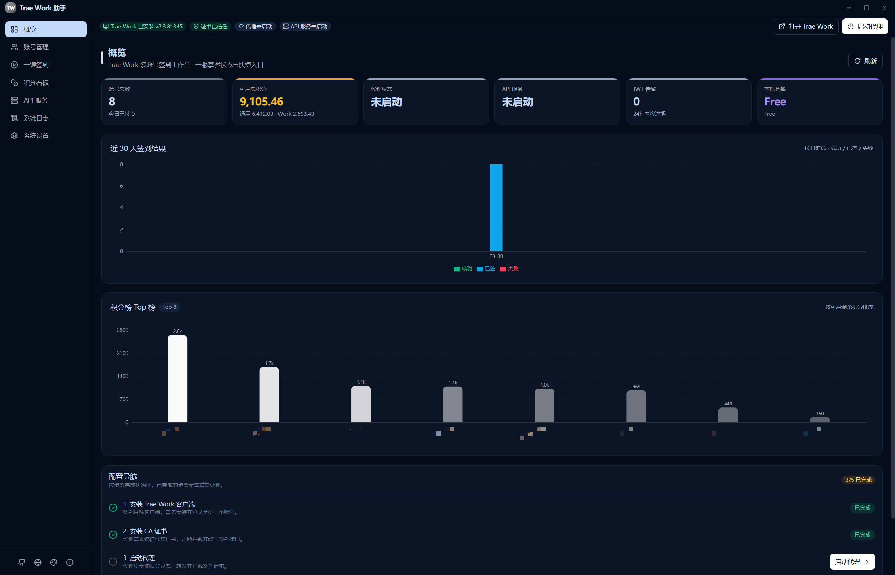

# AI Work 助手 用户手册

> **版本**: v2.4.4 | **平台**: Windows 10 / 11 | **更新日期**: 2026-08-16

## 目录

1. [软件简介](#1-软件简介)
2. [安装与启动](#2-安装与启动)
3. [主界面概览](#3-主界面概览)
4. [账号管理](#4-账号管理)
5. [一键签到](#5-一键签到)
6. [积分看板](#6-积分看板)
7. [API 服务](#7-api-服务)
8. [本地代理](#8-本地代理)
9. [运行日志](#9-运行日志)
10. [系统设置](#10-系统设置)
11. [常见问题](#11-常见问题)

---

## 1. 软件简介

AI Work 助手 是一款 Windows 桌面端多账号管理一站式工作台，**深度支持 Trae Work 与 Trae（Trae CN IDE）双应用**：账号管理、自动签到、登录态双应用独立切换、积分看板、本地 API 网关等功能。所有数据存储在本地，不上传任何服务器。

**核心功能**：

- 多账号 JWT 管理（手动录入 / OAuth 登录 / 代理自动捕获 / **本机双应用自动发现**）
- 一键批量签到（支持分组、跳过已签/过期）
- 登录态快照保存与账号切换（**按目标应用选择 Trae Work / Trae**，精准备份 9 类核心文件；同一账号可分别为两应用创建快照，相互独立）
- 积分看板（排行 + 三线趋势图，区分通用积分与 Work 套餐积分）
- OpenAI / Anthropic 兼容 API 网关（账号池智能调度，两应用账号入同一池）
- 6 层设备标识重置
- 定时自动签到

---

## 2. 安装与启动

### 系统要求

- Windows 10 / 11（64 位）
- WebView2 Runtime（Windows 11 已内置）
- 管理员权限（仅安装 CA 证书时需要）

### 安装

下载最新版本的 MSI 或 NSIS 安装包，双击运行即可完成安装。

### 首次启动

首次启动后，建议按以下顺序配置：

1. **安装 CA 证书**：顶部栏「证书未安装」徽标 → 点击「安装证书」（仅首次使用代理功能需要；总览页与设置引导中也有入口）
2. **检测应用环境**：前往「环境配置」→ 分别对 **Trae Work 与 Trae** 点击「自动检测」，填入两应用的 exe 路径
3. **添加账号**：前往「账号管理」→ OAuth 登录 / 手动粘贴 JWT，或点击「扫描本机」自动发现 Trae Work 与 Trae 中已登录的账号一键入池
4. **保存登录态**：在 Trae Work 或 Trae 中登录账号后，点击该账号行的「保存」图标并**选择目标应用**创建快照
5. **一键签到**：前往「一键签到」→ 点击「全部签到」

---

## 3. 主界面概览



主界面由以下部分组成：

| 区域 | 说明 |
|------|------|
| **标题栏** | 左上角显示应用名称，右侧窗口控制按钮（最小化/最大化/关闭） |
| **侧边栏** | 导航菜单，包含 6 个功能页面；左下角为系统设置 / 系统日志 / 软件说明 / 主题切换按钮 |
| **顶部栏** | 当前页面标题 + 快捷操作按钮 |
| **内容区** | 当前页面的主要内容 |

**侧边栏导航**：

- **概览** — 账号签到状态概览与环境引导
- **账号管理** — 账号 CRUD、分组、**双应用**登录态切换
- **一键签到** — 批量签到操作
- **积分看板** — 积分排行与趋势图
- **API 服务** — OpenAI / Anthropic 兼容 API 网关配置
- **环境配置** — 两应用路径检测、代理、定时任务等配置

**侧边栏左下角工具按钮**：

- **系统设置 / 系统日志**（滑杆图标）— 弹框双页签：外观 / 语言 / 通知 / 代理等系统设置，以及运行日志、代理日志、API 请求日志查看
- **软件说明**（信息图标）— 版本、概述、作者与版权
- **主题切换**（调色板图标）— 在 6 套主题间轮询

---

## 4. 账号管理

### 4.1 添加账号

支持三种方式添加账号：

#### 方式一：OAuth 登录（推荐）

1. 点击「OAuth 登录」按钮
2. 系统自动打开浏览器跳转到 Trae 登录页
3. 在浏览器中完成登录
4. 复制浏览器地址栏的回调 URL（以 `http://127.0.0.1` 开头）
5. 粘贴回应用并确认
6. 系统自动解析 JWT 和用户信息，保存账号

> OAuth 登录的账号自带 refresh_token，支持 JWT 自动续期。

#### 方式二：手动粘贴 JWT

1. 点击「添加账号」按钮
2. 输入账号名称
3. 粘贴 JWT token（以 `eyJ` 开头的长字符串）
4. 系统自动校验 JWT 有效性并解析用户 ID
5. 选择分组（可选）
6. 点击保存

#### 方式三：代理自动捕获

1. 前往「系统设置」→ 启动本地代理
2. 在 Trae Work 中登录任意账号
3. 代理自动捕获 JWT 并添加到账号列表

### 4.2 账号操作

每个账号行提供以下操作按钮：

| 按钮 | 说明 |
|------|------|
| **保存** (Save 图标) | 保存当前 Trae Work 登录态到该账号的快照 |
| **切换** (LogIn 图标) | 切换到该账号（保存当前 → 恢复目标 → 启动） |
| **重置** (RotateCcw 图标) | 重置该账号的设备 ID |
| **编辑** (Pencil 图标) | 编辑账号名称或 JWT |
| **删除** (Trash2 图标) | 删除账号（可选同时删除登录态快照） |
| **刷新** (Zap 图标) | 自动刷新 JWT（需 refresh_token） |
| **续期** (KeyRound 图标) | 启动代理并切换到该账号，通过代理捕获新 JWT |

### 4.3 保存登录态

**首次使用前必须操作**：

1. 在 Trae Work 或 Trae 中登录目标账号
2. 回到本应用，找到该账号行
3. 点击 **保存** 图标，并**选择目标应用（Trae Work / Trae）**
4. 系统会：关闭目标应用 → 精准备份 9 类核心登录文件 → 重新启动该应用
5. 备份完成后，该账号的快照出现在「快照管理」中（按应用分目录存储）

> 9 类核心文件：storage.json、state.vscdb、machineid、aha 目录、Network 目录、Local Storage、Session Storage、Preferences、Local State。

### 4.4 切换账号

1. 确保目标账号已保存登录态（有快照）
2. 点击目标账号行的 **切换** 图标，并**选择目标应用（Trae Work / Trae）**
3. 系统自动执行：
   - 保存当前登录态到当前账号槽位 + `last` 安全槽位
   - 恢复目标账号的登录态
   - 重新启动目标应用
4. 启动后应用自动以目标账号登录

> 同一账号可分别为 Trae Work 与 Trae 创建快照，两应用快照相互独立、可分别切换。如果目标应用下无快照，切换会被中止并提示「无快照」。请先用「保存」图标创建快照。

### 4.5 快照管理

点击「快照管理」按钮查看所有已保存的登录态快照；弹框顶部可切换 **Trae Work / Trae** 应用，分别查看两应用的快照：

| 列 | 说明 |
|----|------|
| 账号 (user_id) | 快照对应的账号 ID |
| 文件数 | 快照包含的文件数量 |
| 大小 | 快照总大小 |
| 最后修改 | 最后一次备份时间 |
| 操作 | 备份 / 恢复 / 删除 |

- `last` 槽位是切换时自动创建的安全备份
- 支持手动备份、恢复和删除操作

### 4.6 分组管理

- 点击「添加分组」创建新分组
- 拖拽账号到分组（或通过右键菜单移动）
- 分组支持自定义颜色和排序
- 删除分组时，组内账号自动归入「未分组」

### 4.7 帮助说明

点击账号管理页面右上角的 **帮助** 按钮，可查看以下功能的详细说明：

- OAuth 登录流程
- 保存当前登录态
- 切换账号流程
- 快照管理
- 重置设备 ID
- 代理自动抓取账号
- JWT 续期与刷新

---

## 5. 一键签到

### 5.1 签到范围

| 选项 | 说明 |
|------|------|
| 全部账号 | 对所有账号执行签到 |
| 按分组 | 仅对指定分组的账号签到 |
| 手动选择 | 勾选要签到的账号 |

### 5.2 签到选项

- **跳过已签到**：当日已签到的账号自动跳过
- **跳过已过期**：JWT 已过期的账号自动跳过

### 5.3 签到状态

| 状态 | 说明 |
|------|------|
| 成功 | 签到完成，显示获得积分 |
| 已签到 | 当日已签到，跳过 |
| 失败 | 签到失败，显示错误信息 |
| 冷却中 | 账号处于错误冷却期，自动跳过 |

### 5.4 错误冷却机制

签到失败后，根据错误类型自动进入冷却：

| 错误类型 | 冷却时长 | 说明 |
|---------|---------|------|
| PlanLimit | 12 小时 | 额度不足，短期不会恢复 |
| SoftRate | 60 秒 | 请求频率限制 |
| SessionDead | 需重登 | JWT 失效，需重新登录 |
| Server | 10 分钟 | 服务器错误，累计触发 |
| Client | 10 分钟 | 客户端错误，累计触发 |

> 冷却到期后账号自动恢复可签到状态。签到成功后自动清除冷却。

---

## 6. 积分看板

### 6.1 积分排行

展示所有账号的积分排名，包括：

- 账号名称和 ID
- 当前积分总量
- 今日获得积分
- 积分过期时间

### 6.2 三线趋势图

折线图展示近 30 天的积分变化趋势：

- **总数线**：所有账号积分总和
- **获得线**：每日签到获得的积分
- **消耗线**：每日消耗的积分

### 6.3 数据刷新

点击右上角刷新按钮可手动刷新全部积分数据。系统会逐个查询账号的剩余积分和过期时间。

> 积分数据来源优先级：快照数据 > 签到历史数据

---

## 7. API 服务

### 7.1 接口配置

| 配置项 | 说明 |
|--------|------|
| 端口 | API 服务监听端口（默认 3000） |
| API Key | Bearer Token 鉴权密钥（留空则跳过鉴权） |

> API Key 在界面中掩码显示（前 4 + 后 4 + ****），复制时同样掩码。

### 7.2 账号池

选择参与 API 服务的账号：

1. 在账号池列表中勾选要启用的账号
2. 点击「保存配置」
3. 启动 API 服务后，系统自动从启用的账号中选择最优账号处理请求

**智能调度策略**：

- 跳过禁用/冷却中/积分已过期的账号
- 优先使用积分即将过期的账号
- 单账号额度耗尽时自动切换下一个可用账号
- 单请求最多换号 3 次

### 7.3 使用方式

API 服务启动后，可使用标准 OpenAI SDK 调用：

```python
from openai import OpenAI

client = OpenAI(
    api_key="your-api-key",
    base_url="http://127.0.0.1:3000/v1"
)

response = client.chat.completions.create(
    model="doubao-pro",
    messages=[{"role": "user", "content": "Hello!"}],
    stream=True
)
```

**支持接口**：

- `POST /v1/chat/completions` — 对话（流式 + 非流式）
- `GET /v1/models` — 模型列表
- `GET /status` — 账号池状态
- `GET /health` — 健康检查

### 7.4 IDE 积分说明

API 服务使用 **IDE 积分**（product_id 208，通过签到获取），不是 Work 积分（product_id 209）。请在签到后确认账号有可用的 IDE 积分。

### 7.5 运行状态

API 服务页面提供两个 Tab：

- **服务**：接口配置、账号池选择、实时状态、IDE 积分说明
- **日志**：API 请求日志（Debug 开关控制详细记录）

---

## 8. 本地代理

### 8.1 代理功能

本地 MITM 代理提供以下功能：

- 自动捕获 JWT token（登录 Trae Work 时）
- 为每个账号注入独立设备 ID
- 记录 Trae Work API 请求日志

### 8.2 启动代理

1. 前往「系统设置」→ 代理配置
2. 设置代理端口（默认 8899）
3. 点击「启动代理」
4. 首次使用需安装 CA 证书

### 8.3 CA 证书安装

代理使用自签名 CA 证书进行 HTTPS 解密，需安装到系统「受信任根证书颁发机构」：

1. 点击「安装证书」按钮
2. 系统弹出 UAC 提权确认
3. 确认后自动安装到 Root 证书库

> CA 证书仅用于本地回环 127.0.0.1，不会影响其他 HTTPS 流量。

### 8.4 系统代理设置

启动代理后，系统会自动配置 Windows 代理设置：

- 代理地址：`127.0.0.1:8899`
- 代理例外：`127.0.0.1;localhost;<local>`

关闭代理时自动恢复原设置。

---

## 9. 运行日志

### 9.1 日志类型

运行日志页面支持查询以下三类系统日志：

| 类型 | 文件 | 说明 |
|------|------|------|
| 代理日志 | proxy.log | MITM 代理运行日志 |
| 签到日志 | checkin.log | 签到操作记录 |
| 切换日志 | switcher.log | 账号切换/保存操作记录 |

此外，`logs/` 目录还包含以下日志（通过对应功能页面查看）：

| 类型 | 文件 | 说明 |
|------|------|------|
| 代理请求日志 | proxy_req_YYYY-MM-DD.log | 结构化代理请求记录（代理日志页面查看） |
| API 请求日志 | api_*.log | API 服务请求记录（API 服务页面查看） |

### 9.2 日志查看

- 按类型筛选（全部 / 代理 / 签到 / 切换）
- 按日期筛选
- 关键词搜索
- 最多显示 500 条（按时间倒序）

### 9.3 操作

- **复制**：将当前筛选结果复制到剪贴板
- **导出**：导出为文本文件

---

## 10. 系统设置

### 10.1 代理配置

- 代理端口设置
- CA 证书状态查看与安装
- 监听域名列表配置（默认含 Trae 系域名与 doubao.com，旧默认自动迁移；可自定义覆盖）
- 代理启动/停止

### 10.2 定时签到

- 设置每日签到时间（HH:MM 格式）
- 注册/查看/删除 Windows 计划任务
- 计划任务以**当前登录用户身份**运行，无需管理员权限（v2.4.3 起不再使用 `/RL HIGHEST`，避免普通用户注册失败）
- 未注册时点击「查询」会明确提示「未注册每日签到任务」，注册/取消失败会展示可读的中文原因

### 10.3 设备标识重置

- **单账号重置**：在账号管理页面操作，仅删除该账号的设备 ID 映射
- **6 层全局重置**：在设置页面操作，重置以下 6 层设备标识：
  1. `machineid` 文件
  2. `storage.json` 中 `telemetry.machineId` / `telemetry.sqmId`
  3. `storage.json` 中 `aha.device.device_id`
  4. `aha/TinyStorage` 中 `device_id`
  5. 注册表 `HKLM:\SOFTWARE\Microsoft\Cryptography\MachineGuid`
  6. `trae-webview` 追踪数据（Cookies / Local Storage / Session Storage）

### 10.4 其他设置

- Trae Work 安装路径（自动检测，可手动指定）
- 日志目录配置
- 数据目录查看
- 暗色模式切换

---

## 11. 常见问题

### Q: 开启本地代理后 GitHub / Google 打不开（ERR_TUNNEL_CONNECTION_FAILED）？

**A**: v2.4.3 已修复。原因是开启代理会把 Windows 系统代理整体改为 `127.0.0.1:8899`，覆盖了 VPN（Clash / v2rayN 等）的接管点，而代理对非 Trae 域名走直连、绕开了 VPN，于是外网站点被阻断（国内站点直连可达所以不受影响）。

v2.4.3 起，代理启动时会**自动读取你已有的系统代理作为上游**并串联转发，停止代理时**原样还原**原来的系统代理设置，因此本地代理与 VPN 可以同时开启。

> ⚠️ 该修复位于打包进安装包的 Python 脚本中，请确认已升级到 v2.4.3 正式安装包（旧安装包内仍是旧脚本）。

### Q: 定时任务查询提示乱码（如 `����: ϵͳ�Ҳ���ָ�����ļ���`）？

**A**: v2.4.3 已修复。`schtasks` 的中文输出是 GBK 编码，旧版本按 UTF-8 解读导致乱码；该乱码实际含义是「系统找不到指定的文件」，即**任务尚未注册**。升级后会直接显示「未注册每日签到任务（请先在设置页点击「注册任务」）。」，且不再出现「查询失败：查询计划任务失败：」这类重复前缀。

### Q: 切换账号后仍然是原来的账号？

**A**: 请确保目标账号已保存登录态。首次使用前，需要在 Trae Work 中登录目标账号，然后回到应用点击「保存」图标创建快照。切换时会先保存当前账号的登录态，再恢复目标账号的快照。

### Q: 快照管理中看不到已保存的快照？

**A**: 快照存储在 `%APPDATA%\AIWorkAssistant\data\profiles\` 目录下。如果看不到快照，请确认应用已更新到最新版本（v2.4.1+），旧版本可能存在路径不一致的问题。

### Q: JWT 过期了怎么办？

**A**: 
- 如果账号有 refresh_token（OAuth 登录的账号），点击「刷新」按钮自动续期
- 如果没有 refresh_token，点击「续期」图标，系统会启动代理并切换到该账号，通过代理捕获新 JWT
- 也可以重新通过 OAuth 登录添加账号

### Q: API 服务返回 401 错误？

**A**: 
- 检查 API Key 是否正确配置
- 检查账号池中是否有可用账号（未冷却、有 IDE 积分）
- 查看运行日志中的切换日志排查具体错误

### Q: 签到失败提示「额度不足」？

**A**: 账号的 IDE 积分已耗尽，签到获取的积分与 API 服务消耗的积分是同一池。该账号会自动进入 12 小时冷却。次日签到补充积分后自动恢复。

### Q: 代理无法捕获 JWT？

**A**: 
- 确认 CA 证书已安装（系统设置 → 证书状态）
- 确认系统代理已开启（代理启动后自动配置）
- 确认 Trae Work 的网络流量经过代理（检查代理例外列表未包含 trae.cn）

### Q: 日志第一条显示异常？

**A**: 这是 PowerShell 5.1 的 UTF8 BOM 导致的已知问题，已在 v2.4.1 中修复。如果仍然出现，请确认应用已更新到最新版本。

### Q: 数据存储在哪里？

**A**: 所有数据存储在 `%APPDATA%\AIWorkAssistant\` 目录下：
- `conf/` — 配置文件
- `data/` — 账号、积分、快照等数据
- `logs/` — 运行日志（proxy / checkin / switcher / api / proxy-requests）

卸载应用不会删除数据目录。如需完全清除，请手动删除该目录。

---

> **免责声明**: 本工具与 Trae Work 官方无任何关联，仅供学习研究。使用本工具可能违反 Trae Work 服务条款，风险自担。

## 12. 豆包应用

侧边栏左下方应用切换 Tab 选择「豆包」进入豆包专区（顶栏仅显示豆包安装状态与「打开豆包」）。豆包桌面版为 Chromium 内核，本工具采用**目录级快照**方案管理多账号（与 Trae 快照相互独立）。

### 12.1 概述

展示账号总数（当前账号）、安装情况（四级自动探测：手动指定 → 注册表 → 默认路径 → 进程反查，含版本号）、登录态快照数与数据目录定位结果，以及账号概览列表（最近 5 个，点击进入账号管理）。

账号概览下方为**配置导航**，按步骤引导完成豆包管理初始化（完成判定实时刷新）：

1. **安装豆包客户端**（一键打开豆包；代理运行中时自动以 `--proxy-server` 注入启动，客户端流量必走代理，凭证/额度抓取不依赖系统代理）
2. **保存当前登录态**（生成首个可切换快照）
3. **信任 CA 证书**（会员额度接口抓包需要）
4. **启动代理**（自动抓取当前账号会话凭证并回写账号池，顶栏也有状态徽标与启停按钮）
5. **查看会员额度**（接口已内置默认值，自动查询并显示会员/免费标识）

### 12.2 账号管理

- **保存当前登录态**：登录豆包后点击右上角「保存当前登录态」，工具自动探测当前账号 user_id 并预填（全树递归解析 `%APPDATA%\Doubao\public_config.json`，识别失败时兜底最近保存记录；仍失败可手动输入），可选设置别名；保存时先关闭豆包 → 白名单快照 → 重启。
- **快照内容**：Cookies（登录态核心）、Local State（账号缓存与解密密钥元数据）、Local Storage、Session Storage、DoubaoStorage、saman 账号体系状态；体积较大的 IndexedDB 默认排除（可在环境配置页开启，见下）。
- **一键以账号打开**（推荐常用）：列表中点击**火箭图标**，一步完成「恢复该账号快照 → 拉起豆包」，无需再走「切换 → 等待 → 打开」两步；代理运行中时自动注入代理，行为与「一键打开豆包」一致。无快照的账号该按钮不可用，需先保存登录态。
- **切换账号**：列表中点击切换图标，流程为 关闭豆包 → 当前登录态自动备份（last 槽 + 原账号槽）→ 恢复目标快照 → 重启豆包。适合「只切换不立刻打开」的场景；想直接打开请用上面的一键按钮。
- **快照版本校验**：保存快照时会一并记录豆包（Chromium 内核）版本与 `schemaVersion`；恢复前自动校验——快照由不兼容版本生成、或 leveldb 索引（`CURRENT` / `MANIFEST`）缺失损坏时**直接中止恢复**并提示重新登录保存，避免写入损坏的登录态；若只是豆包版本升级（如 140 → 147），仅给出警告并继续恢复（旧快照通常兼容，异常时重新登录即可）。账号列表「已保存」处鼠标悬停可查看该快照的版本与保存时间。
- **IndexedDB 可选纳入**：默认排除（体积大，实测约数 MB/账号）。在「环境配置 → 快照设置」开启后，保存/切换时把 `IndexedDB` 一并纳入快照，**对话历史等完整状态可随账号一起迁移**；代价是快照体积与保存耗时明显增加。恢复时只要快照内含 IndexedDB 就会回写，与当前开关状态无关。
- **其他操作**：编辑别名/备注/会话凭证、删除账号（移出账号池并删除该账号快照，需经两次确认，不可恢复）。

> 快照存储于 `data/profiles_doubao/<uid>/`，账号元数据存于 `data/doubao_accounts.json`。

### 12.3 会话保活与环境配置

- **每日保活（推荐）**：环境配置页注册「每日任务」（schtasks），到点自动「启动豆包 8 秒 → 优雅关闭」，由客户端自己联网完成 sid_guard 30 天滑动续期；豆包正在运行时自动跳过。也可在账号管理页点「立即保活」手动触发。
- **到期提醒**：超过 25 天未保活、或账号会话判定过期 / 7 天内到期时，进入豆包页会弹出提醒。
- **续期巡检（高级）**：账号编辑弹框可查看/修改 sessionid / sid_guard（已存凭证自动回填；清空后保存即删除；凭证等同密码，仅存本地），有凭证的账号可运行「探活巡检」：携带凭证访问保活端点（默认 `https://www.doubao.com/info/v2/`，可配置），自动回写续期后的新值、标记已过期账号。若所有账号都未录入凭证，巡检会自动改走保活方式（启动豆包完成会话刷新），不会空转。**凭证自动获取**：代理开启且豆包流量经过代理时，代理会自动从 Cookie 提取 sessionid / sid_guard 并自动回写到当前登录账号（账号管理页每 20 秒检查一次，有变化才写入）；编辑弹框也保留「从代理抓包自动填充」按钮手动触发。豆包桌面客户端 cookie 为客户端级加密，无法直接提取，代理抓包是唯一推荐方式。
- **Cookie 诊断**：校验当前 User Data 与各快照的 cookie 可解性。实测豆包桌面客户端 cookie 值为客户端级二次加密，无法自动提取明文 sessionid——这也是保活方案由豆包客户端自己完成的原因。
- **凭证到期分层提醒**：解析 sid_guard（sid|创建时间|有效期）计算到期日，账号列表会话列显示「有效 · 日期到期」；**7 天内到期**变黄色「N 天后到期」徽标（悬停看具体日期），已过到期日显示红色「凭证已到期」。
- **应用位置**：安装位置四级自动检测（显示探测来源与版本），可手动指定 exe 路径持久化。
- **快照设置**：「IndexedDB 纳入快照」开关（默认关）。开启后保存/切换账号时把对话历史等 `IndexedDB` 数据一并纳入快照，实现完整状态迁移；代价是快照体积与保存耗时显著增加（实测约数 MB/账号）。

### 12.4 会员额度

- 额度接口已内置默认值（代理抓包实测固化：`/alice/commerce/sale/subscription/quota/summary/`），开箱即用；豆包若更新接口，可在「环境配置 → 会员额度」修改。
- 之后在「账号管理」对已录入会话凭证（sessionid，见 12.3）的账号点击额度按钮，即可查看：**额度状态**（当前时段 / 近 7 天窗口的已用百分比与重置时间，用完显示红色进度条）、**会员等级与到期时间**、**订阅记录**（套餐名 / 周期天数 / 起止日期 / 是否活动赠送）。
- **每日额度巡检（推荐）**：环境配置页注册「每日巡检」（schtasks），到点自动批量查询池内全部有凭证账号的额度，回写缓存与历史；额度用完的账号在应用内提醒（含重置时间）。
- **额度趋势与健康度**：概述页展示近 14 天「当前时段」额度用量走势图与近 7 天运维健康卡（保活 / 探活巡检 / 额度查询次数、最近保活时间），数据来自运维历史（本地滚动保留 400 条）。
- 仅查询展示，不做代刷；凭证等同密码，仅本地存储并全程掩码展示。

> **合规说明**：本工具仅管理本人合法持有的账号，不破解、不绕过付费。手动录入的 sessionid 等凭证等同密码，仅本地存储并全程掩码展示；客户端加密机制不做破解。
